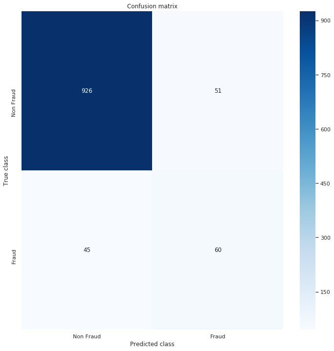
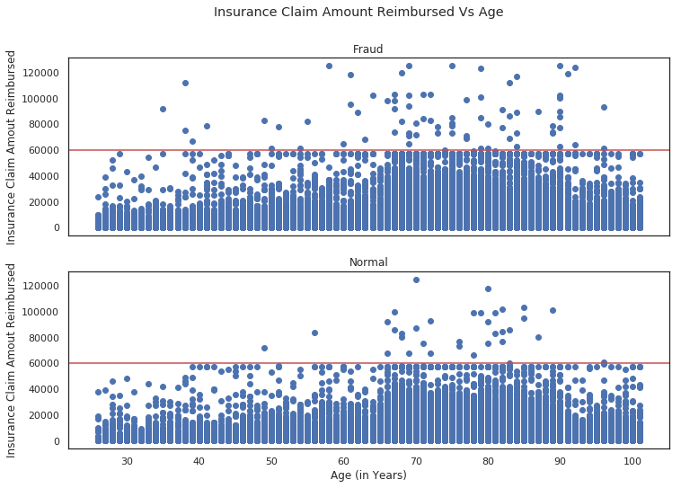
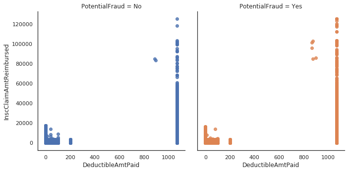
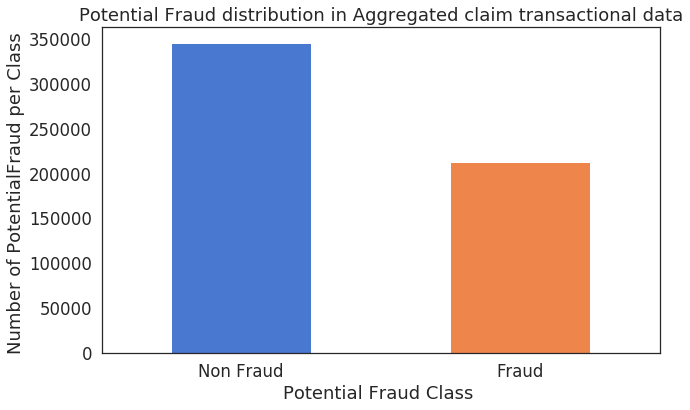
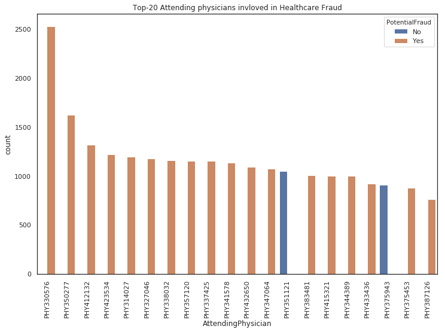

# Jatayu_Healthcare_fraud_detection-main
VIRTUSA
<!-- "# Jatayu_Healthcare_fraud_detection"  -->

# insurance claimed vs age

# potential fraud

# potential fraud in individual provided data

#potential fraud in aggregated data

# doctors involved in fraud

